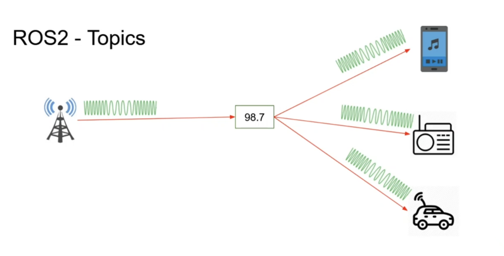
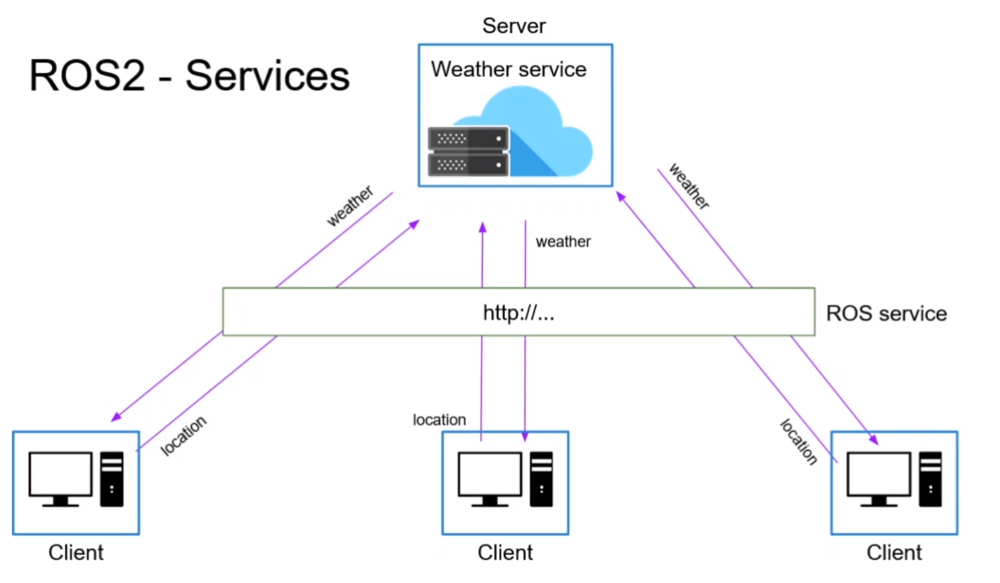

# Notes from Tutorial

---

## Create a python package

1. `cd ~/ros2_ws/src`
2. `ros2 pkg create my_pkg --build-type ament_python --dependencies rclpy`

    * The `--build-type ament_python` is required to tell ros2 pkg what kind of package it will be creating.
    * And you include dependencies at the end as well.

## Create a C++ package

1. `cd ~/ros2_ws_src`
2. `ros2 pkg create my_cpp_pkg --build-type ament_cmake --dependencies rclcpp`

    * Same thing with build type, but for c++ it is "ament_cmake".
    * And just like with the python version, you can specify dependencies.


## ROS2 Nodes

* A node is a sub-part of an application that typically handle a specific task.
* An application will likely have many nodes, split among packages which will communicate with each other.
* Nodes are combined into a graph like structure
* Nodes communicate with each other using topics, services and parameters.

#### Benifits:

* Reduce code complexity
* Fault tolerance.  If one node crashes, this will not cause other nodes to crash.
* Can be written in Python, C++, ...


## Creating a Python Node Inside a Python Package

1. cd to python package folder

    ```
    cd ~/ros2_ws_tutorial/src/my_py_pkg/my_py_pkg
    ```

    For a new Python package, this only contains the `__init__.py` file. 

2. Create file for node

    ```
    touch my_first_node.py
    ```

3. See [this file](../src/my_py_pkg/my_py_pkg/my_first_node.py) for a barebones example of a Python ros2 node.

4. After writing a node similar to the file linked above, run the following from the current location.

    ```
    chmod +x my_first_node.py
    ./my_first_node.py
    ```

    This should output something like:

    ```
    [INFO] [1669071800.580866279] [py_test]: Hello ROS2
    ```

## Install Python Node

1. Open the `setup.py` file in package directory
2. In the setup function, in the entry_points parameter, add to the 'console_scripts' using the form below:

    ```py
        entry_points={
        'console_scripts': [
            "<executable_name> = <python package>.<python file>:<function>"
        ],
    ```
    Here is an example using the my_py_pkg example from the tutorial:
    ```py
        entry_points={
        'console_scripts': [
            "py_node = my_py_pkg.my_first_node:main"
        ],
    ```

3. This will create an executable file in the install directory.  For this example it should be located here:

    ```
    ~/ros2_ws_tutorial/install/my_py_pkg/lib/my_py_pkg
    ```

    In order to run this you will need to source, otherwise you will get an error.

    ```
    source ~/ros2_ws_tutorial/install/setup.bash
    ```

    However this is not typically how you would run ros2 nodes, you would run this node like so:

    ```
    ros2 run my_py_pkg py_node
    ```


## Writing a Python ROS2 Node using Object Oriented Programming (Recommended)


* See the differences between [the barebones version](../src/my_py_pkg/my_py_pkg/my_first_node.py) and [the object oriented version](../src/my_py_pkg/my_py_pkg/oop_node.py)

* These nodes do the same function, but the node has been built using a more oop style.

* To run this you would also need to add this node to the setup.py in the base folder of the my_py_pkg like we did with my_first_node.


* For an example of a python node using a timer to start a callback function see [this file here.](../src/my_py_pkg/my_py_pkg/oop_node_timer.py)


## Creating a c++ Node Inside a c++ Package

1. Enter the src directory of the c++ package
2. Create a node file:

    ```
    touch my_first_node.cpp
    ```

3. Enter the following into the file:

    ```c++
    #include "rclcpp/rclcpp.hpp"


    int main(int argc, char **argv) {
        
        
        return 0;
    }
    ```

    If `#include "rclcpp/rclcpp.hpp"` is underlined and showing the `#include errors detected.` you need to add the path for VS Code to know where that file is. This will still compile without these steps, but this will make it easier as a developer.

    1. Press `ctrl` + `shift` + `p`.
    2. Type and select from the drop down menu: `>C/C++:Edit Configurations (JSON)`.

        If this is a new project, VS Code will create a .vscode directory and a c_cpp_properties.json file that will look like this:

        ```json
        {
            "configurations": [
                {
                    "name": "Linux",
                    "includePath": [
                        "${workspaceFolder}/**"
                    ],
                    "defines": [],
                    "compilerPath": "/usr/bin/clang",
                    "cStandard": "c17",
                    "cppStandard": "c++14",
                    "intelliSenseMode": "linux-clang-x64"
                }
            ],
            "version": 4
        }
        ```

        Then under the `"includePath"` create another entry to the ros2 global include directory, for example:

        ```json
        "includePath": [
            "${workspaceFolder}/**",
            "/opt/ros/humble/include"
        ]
        ```

        That should remove the error from VS Code.

   3. See [this file](../src/my_cpp_pkg/src/my_first_node.cpp) for a barebones example of a c++ ros2 node.

        Also see the [CMakeLists file](../src/my_cpp_pkg/CMakeLists.txt) which shows what is minimally needed to install this node correctly.


   4. To run:

        ```
        source ./ros2_ws_tutorial/install/setup.bash
        ros2 run my_cpp_pkg cpp_node
        ```

        Output:

        ```
        [INFO] [1669076745.239056440] [cpp_test]: Hello cpp Node
        ```

## Colcon

* There are a few commands to know
  

* General build command:

    ```
    colcon build
    ```

* Build a specific package:

    ```
    colcon build --packages-select my_py_pkg
    ```

* Creating a link directly to source files instead of generating new files:
* This is very helpful in python because any changes to source will not need to be re-build.  C++ also has an advantage where VScode errors will link directly to the file.

    ```
    colcon build --symlink-install
    ```

## rqt and rqt_graph

* These are debugging tools that help with ros development.
* rqt is a tool that has many plugins that help with many different aspects of ros2.
* rqt_graph is a plugin within rqt that shows a graph style visualization of the current running nodes and topics on your system.
* To open, here are the commands respectively:
  
    ```
    rqt
    rqt_graph
    ```

## ROS2 - Topics

* Topics are one of the ways that ROS nodes communicate with each other.

* Here is an analogy:

    * Think of a radio transmitter as a publisher.
    * The radio transmitter publishes to a topic (frequency of 98.7)
    * Subscribers than can listen to that topic.

    * Publishers and subscribers need to be using the same data structure, in the analogy this would be an encoding standard (AM/FM).

    See here:

    

* Communication using topics are anonymous.  Subscibers and publishers only know they are communicating over a topic, they recieve no information about who is sending or recieving the messages.


## ROS2 - Services

* These are another type of comunication between nodes. These are a server/client style of communication.
* These can be synchronous or asynchronous
* One message type for requests, and one message type for responce.
* Can be written in Python or C++ in ROS2 nodes.

* Here is an analogy:

    * Think of a website that provides a weather service.
    * There are clients that will send requests with their location data.
    * The weather service will send responces to each client of the appropriate weather data for their location.
    * This is all done using an `http` service.

    See here:

    


* Here we can look at an example service:

    * Type in this command:

        ```
        ros2 interface show example_interfaces/src/AddTwoInts
        ```

    * This will output:

        ```
        int64 a
        int64 b
        ---
        int64 sum
        ```

    * The two integers on top are the inputs, and the bottom integer is the response.

    * Every service will have a 3-dash separator between the inputs and the responses.